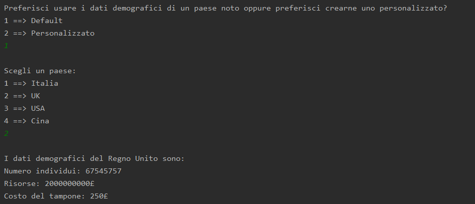

# SimulatoreEpidemiologico
Questo simulatore è stato ideato e implementato in collaborazione con il mio collega _Harachili_.
Esso nasce come progetto per il corso di informatica _Metodologie di programmazione_.


## Contenuti
- [Struttura del simulatore](#struttura-del-simulatore)
- [Parametri presi in input](#parametri-presi-in-input)
  - [Parametri di default](#parametri-di-default)
    - [Paesi](#paesi)
    - [Virus](#virus)
- [Possibili esiti della simulazione](#possibili-esiti-della-simulazione)
- [Screenshot](#screenshot)

<hr>

## Struttura del simulatore
Nel progetto si è cercato di realizzare un programma in grado di simulare il più fedelmente possibile un caso di epidemia, attenendosi a diversi casi studio resi ufficiali da vari enti pubblici.
Una volta avviato il programma l’utente ha la possibilità di scegliere se simulare un’epidemia all’interno di un paese già noto oppure creare un paese secondo i parametri che si vogliono inserire in input (vedi [Paesi](#paesi)) e la possibilità di scegliere, proprio come prima, se utilizzare un virus già analizzato dal ministero della salute di cui si conoscono già i dati epidemiologici (vedi [Virus](#virus)) oppure creare un virus "su misura" in modo tale da testare le proprie capacità di gestire una situazione critica dal punto di vista salutare ed economico attraverso un’epidemia mai studiata in letteratura.

Dopo aver impostato a piacere i vari parametri inizia la simulazione vera e propria. L’utente ha in questo momento la possibilità di avanzare senza misure precauzionali (è l’unica scelta disponibile prima dello scoppio dell’epidemia, dal momento che non è possibile attuare strategie finché il primo sintomatico non compaia sulla scena a dare l’allarme), isolare individui sani al fine di minimizzare la contagiosità del virus evitando il contatto sociale, oppure applicare tamponi su persone in movimento scelte a caso, per studiare l’andamento della curva dei 3 contagi e dedurre se si sta lavorando correttamente oppure è necessario un cambio di strategia.

## Parametri presi in input
Parametri generali:
- _Popolazione iniziale_: il numero di individui esistenti all’inizio della simulazione;
- _Risorse iniziali_: la quantità di risorse inizialmente disponibili;
- _Costo del tampone_: il costo della somministrazione di un tampone;
- _Velocità_: il numero medio di incontri che ciascun individuo ha nel corso di una giornata assumendo che tutti siano in movimento.

Parametri sanitari:
- _Infettività_: la probabilità (maggiore di 0) che un individuo sano venga infettato a seguito di un incontro con un contagiato asintomatico o sintomatico;
- _Sintomaticità_: la probabilità (maggiore di 0) che un contagiato sviluppi sintomi;
- _Letalità_: la probabilità (maggiore di 0) che un malato sintomatico muoia;
- _Durata_: il numero di giorni che intercorrono fra il momento del contagio e quello della guarigione.

### Parametri di default

#### Paesi
Il programma offre la possibilità di simulare un'epidemia proponendo 4 diversi paesi noti differenziati dal numero di individui, l’ammontare delle risorse a propria
disposizione e il costo di un tampone:

- Italia
```
Popolazione iniziale: 60359546
Risorse iniziali: 1800000000€
Costo del tampone: 30€
```

- Regno Unito
```
Popolazione iniziale: 67545757
Risorse iniziali: 2000000000£
Costo del tampone: 250£
```

- USA
```
Numero individui: 329311764
Risorse: 6500000000$
Costo del tampone: 1000$
```

- Cina
```
Numero individui: 1433783686
Risorse: 28600000000 ¥
Costo del tampone: 180 ¥
```

#### Virus

Allo stesso modo, in seguito alla scelta del paese in cui simulare l'epidemia, l'utente potrà scegliere uno dei 4 virus di default proposti dal simulatore.
I parametri che contraddistinguono questi virus sono la percentuale di infettività (la carica virale), la propensione da parte degli individui infetti a sviluppare una sintomaticità, la probabilità di morire e la durata del virus dal momento in cui un individuo è stato infettato fino al momento in cui risulta non essere più positivo al virus.

- COVID-19
```
Infettività: 60%
Sintomaticità: 55%
Letalità: 5%
Durata: 21 giorni
```

- Peste
```
Infettività: 65%
Sintomaticità: 80%
Letalità: 50%
Durata: 20 giorni
```

- HIV
```
Infettività: 20%
Sintomaticità: 90%
Letalità: 50%
Durata: 20 giorni
```


- Ebola
```
Infettività: 20%
Sintomaticità: 90%
Letalità: 64%
Durata: 20 giorni
```

## Possibili esiti della simulazione
I possibili esiti dell’epidemia sono tre:
1. la malattia viene debellata, ovvero almeno un individuo rimane in vita e
tutti i vivi sono sani (quindi mai stati infettati) o guariti;
2. la malattia vince, cioè tutti gli abitanti del paese sono morti;
3. collasso dell'economia del paese, avviene quando terminano le risorse disponibili.

## Screenshot


